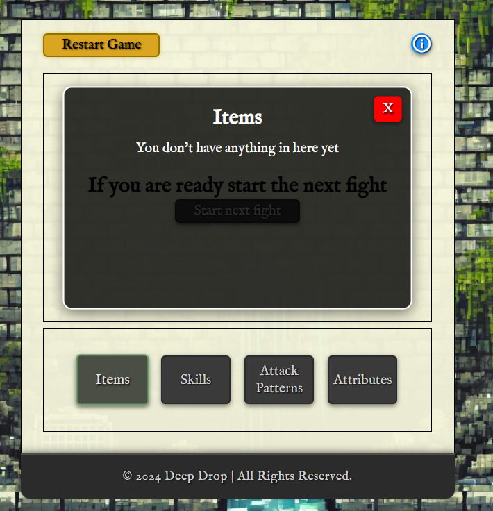
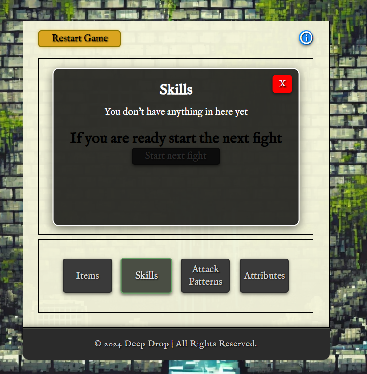
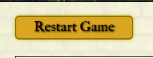
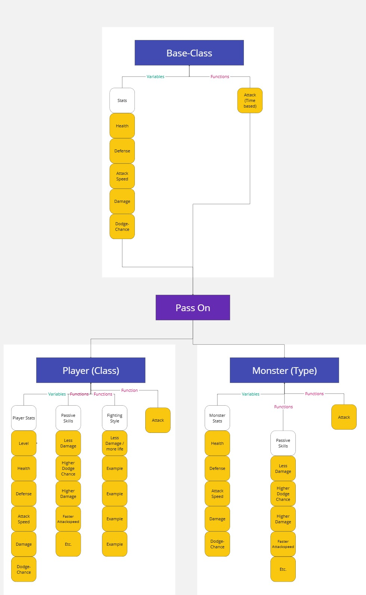
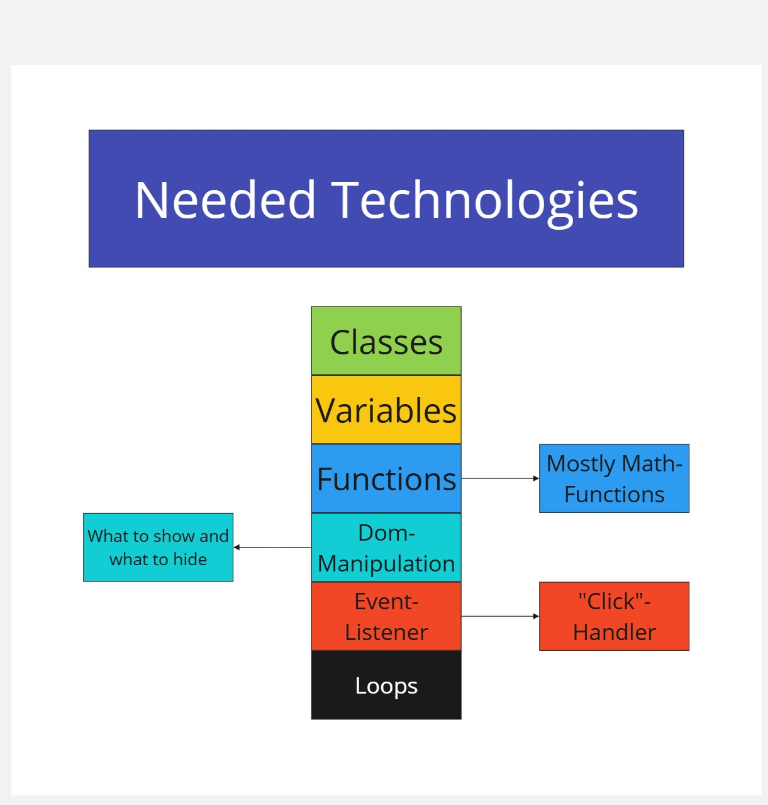

# Deep Drop


## Description

**Deep Drop** is an immersive, turn-based dungeon crawler game where players are challenged to survive the depths of a mysterious well. By battling through 20 progressively difficult levels of monsters, collecting valuable items, and upgrading their characters, players must strategize their way to victory against a formidable final boss. The game features three distinct character classes, numerous rewards, and tactical gameplay mechanics that test players' decision-making skills. With a captivating medieval aesthetic, **Deep Drop** is designed to offer both challenge and excitement.

## Live Demo

Experience the game firsthand: [Play Deep Drop here!](https://fairytaib.github.io/Deep-Drop/)







## Features

### Core Gameplay Mechanics

- **Character Selection**:

  - Choose from three unique classes:

    

    - **Knight**: A resilient warrior with high defense and moderate attack power.
    - **Ranger**: A swift and versatile archer, balancing agility and offensive skills.
    - **Assassin**: A stealthy fighter specializing in high damage and critical hits.
  - Each class is designed with specific strengths, weaknesses, and unique abilities, encouraging diverse strategies.

- **Turn-Based Combat**:

  

  - Players face a variety of monsters in automatic battles where stats, equipped items, and selected fighting styles determine outcomes.

- **Reward System**:

  

  - After each victorious battle, choose between:
    - **Items**: Equip gear like weapons, armor, and accessories to enhance your stats.
    - **Skills**: Gain abilities that provide passive bonuses or combat advantages.
    - **Healing Potions**: Restore health to prepare for upcoming challenges.

- **Monsters**:
  - Encounter a diverse lineup of foes, ranging from simple slimes to challenging elemental creatures and a menacing final boss.

### User Interface and Experience

- **Dynamic Menus**:


  - Access intuitive interfaces for managing character stats, equipping items, and selecting fighting styles.

- **Tutorial Mode and restart button**:


  - A comprehensive step-by-step guide introduces players to gameplay mechanics, ensuring a smooth onboarding experience next to a reset button to start over if needed.

- **Loading Screens**:


  - Seamlessly transition between game phases with immersive loading visuals.

- **Responsive Design**:
  - The game is optimized for desktops, tablets, and mobile devices, ensuring accessibility for all players.

  ## How to Play

1. Enter your character's name to start.
2. Select your preferred class (Knight, Ranger, or Assassin) to define your playstyle.
3. Engage in battles against increasingly challenging monsters.
4. After each battle, choose rewards to enhance your character:
   - Equip powerful items.
   - Learn new skills.
   - Heal to prepare for the next fight.
5. Progress through all 10 levels and defeat the final boss to complete the game.

## Key Features in Depth

### Classes and Customization
- **Knight**:
  - High durability and defensive capabilities.
  - Ideal for players who prefer a steady and methodical approach.

- **Ranger**:
  - Balanced stats with a focus on agility.
  - Offers flexibility in both offensive and defensive strategies.

- **Assassin**:
  - High damage output with critical strike potential.
  - Excels in fast-paced and aggressive gameplay.

### Restart Option

The player has the option to reset his game and start over if he doesn't like his run.
His decision has to be confirmed within another Screen




### Tutorial
A tutorial is integrated for better understanding at the start of the game and during the game


When the player starts a run the icon below is always clickable to let the user reread the rules


He can manouver through the slides by clicking on the buttons marked with an arrow.


### Tooltip
Users can inspect a Skill, Item or Fighting Skill by hovering or clicking the name of it


### Rewards and Progression
- Items and skills provide meaningful choices after every battle.
- Strategic planning is crucial for managing health and resources.

### Monsters and Challenges
- Each monster has different strengthes, requiring a solid strategie.

## Working process
The development of Deep Drop followed a structured and iterative process, ensuring clarity and focus throughout the project. Below is an overview of the main steps involved in creating the game:

### Balsamiq wireframe

To begin the project, I created wireframes using Balsamiq. These wireframes allowed me to visualize the overall structure and design of the game. This step was crucial in translating abstract ideas into tangible layouts, ensuring that the design would align with the game's core objectives. Although some elements changed during the process the foundation was build on these wireframes.


Due to the already large scale of the project i waived the additional classes and evolutions

### Miro

After the wireframe stage, I used Miro to further refine the game's structure and flow. Miro served as a dynamic tool for visualizing both the game's mechanics and its underlying code. The following diagrams were created to map out the game's logic and design:

1. General Gameflow
This flowchart outlines the player's journey through the game, from class selection to monster battles and rewards.


2. Fighting System
A detailed view of the turn-based fighting mechanics, illustrating how players and monsters interact during battles.


3. Character Base Class
The core structure for player and monster classes, showing shared attributes such as health, damage, and defense.


4. Item Base Class
A blueprint for the game's item system, detailing how items influence player stats and interact with the game mechanics.


5. Skill Rewards
This diagram illustrates how players unlock and choose skills during their progression through the game.


6. Required Technologies
A visualization of the technologies and tools needed to implement various aspects of the game, from design to functionality.


7. JavaScript Example
A snapshot of the pseudo-code structure for core functionalities, offering a clear starting point for coding.


This structured approach allowed me to stay organized and focus on the most critical elements of the project. Each step provided a clear roadmap for the development process, ensuring that all game mechanics, visuals, and interactions were cohesive and aligned with the original vision.


### Visual Design

- **Medieval Aesthetic**:


  - Styled with custom fonts (MedievalSharp and IM Fell English) to create a classic and immersive atmosphere.

  - **simple colors**:

  

  - A carefully chosen dark color palette with vibrant highlights emphasizes the medieval theme contrasting the reward and character images.


- **Animation Effects**:
  - Hover effects, button transitions, and visual feedback enhance interactivity and player engagement.

### Accessibility Features

- **Keyboard and Mouse Support**:
  - Simple controls ensure an enjoyable experience for all players.

- **Input Validation**:

  
  
  


  - Player name inputs are validated to prevent errors and enhance usability.

## Technologies Used

- **Languages**:
  - HTML: Provides the structural framework for the game.
  - CSS: Styles the game with a medieval theme and ensures responsiveness.
  - JavaScript:
    - Implements game logic, including character management, combat mechanics, and reward distribution.
    - Utilizes modular design for maintainable and scalable code.

- **Version Control**:
  - Git: Used for version control to track changes and manage the development process.
  - GitHub: Used as a cloud-based platform to store and share the code repository.
  - Gitpod: Used as an integrated development environment (IDE) to write and edit the code.


## Project Structure

```plaintext
├── index.html         # Main HTML file
├── assets
│   ├── css
│   │   └── style.css  # Stylesheet for the game
│   ├── javascript
│   │   ├── dom-manipulation.js  # Dynamic DOM updates
│   │   └── class-list.js        # Classes for characters, items, and skills
│   └── images
│       ├── monsters             # Monster images
│       ├── items                # Item images
│       └── background           # Background images
└── README.md         # Project documentation
```

## Getting Started

### Prerequisites

To run **Deep Drop** locally, ensure you have:

- A modern web browser (e.g., Chrome, Firefox, Edge).
- A text editor or IDE (e.g., Visual Studio Code) for code exploration or modifications.

### Installation

1. Clone the repository:

   ```bash
   git clone https://github.com/your-username/deep-drop.git
   ```

2. Navigate to the project folder:

   ```bash
   cd deep-drop
   ```

3. Open `index.html` in your preferred web browser to start playing.

### Deployment

To deploy the project via GitHub Pages:

1. Push the repository to your GitHub account.
2. Go to the repository’s settings and navigate to the **Pages** section.
3. Select the `main` branch and save changes.
4. Your game will be live at `https://<your-github-username>.github.io/deep-drop`.

## Testing and Validation

### Functional Testing

- Validated user inputs, ensuring appropriate length and character restrictions for player names.
- Ensured smooth transitions between gameplay phases, such as battles, rewards, and tutorials.

### Browser Compatibility

Tested on:

- Google Chrome
- Mozilla Firefox
- Microsoft Edge

### Responsiveness

- Verified consistent performance on a range of devices and screen sizes, including mobile.

### Lighthouse performance rating

The website was evaluated using Google's Lighthouse extension and received the following performance ratings on all pages: 

- On Desktop:
  - Performance: 100/100
  - Accessibility: 100/100
  - Best Practices: 100/100
  - SEO: 100/100


- On Mobile:
  - Performance: 92/100
  - Accessibility: 100/100
  - Best Practices: 100/100
  - SEO: 100/100


### Validation

The HTML and CSS have been validated using the W3C Validator to ensure compliance. Javascript was tested by the Jshint Validator

- Index Page HTML Validation:


- CSS Validation:


- Script.js Validation:


- class-list.js Validation:
  


## Bugs Encountered, Solutions, and General Observations

### Bugs Encountered
During the development of **Deep Drop**, several challenges and bugs were encountered. Below is a summary of the most significant ones:

1. **Fighting Style Selection Not Displaying Properly**  
   - **Issue**: Fighting styles were not appearing correctly in the player menu.  
   - **Cause**: The `displayPlayerMenu` function was not appending the fighting styles due to a mismatch in variable references.  
   - **Solution**: Ensured that the correct variable (`playerAvailableFightingStyle`) was passed to the function and verified that all data structures were properly initialized before rendering.

2. **Buttons Overlapping or Misaligned**  
   - **Issue**: Buttons occasionally overlapped with other UI elements, especially on smaller screen sizes.  
   - **Cause**: CSS styling for button positioning was inconsistent across different screen sizes.  
   - **Solution**: Implemented a more robust CSS grid and flexbox system for responsive alignment. Added media queries to ensure consistent spacing and alignment on all devices.

3. **Reward Selection Not Functioning as Intended**  
   - **Issue**: Rewards (skills, items, healing) were not being added to the player's inventory or applied correctly.  
   - **Cause**: The reward selection logic did not update the corresponding player attributes or lists.  
   - **Solution**: Updated the reward selection function to directly modify `playerAvailableItems` and `playerAvailableSkills`. Added real-time feedback to confirm the reward selection.

4. **Monster and Player Health Bar Sync**  
   - **Issue**: Health values displayed during fights occasionally desynced from actual game logic.  
   - **Cause**: The health bar update function was not being called consistently after each attack.  
   - **Solution**: Ensured health bar updates were triggered immediately after health changes, using dedicated event listeners.

## Future Plans

- Add more character classes, monsters, and items to enrich gameplay.
- Introduce a story mode with narrative elements and quests.
- Implement sound effects and background music for greater immersion.


## Credits

**Images and Media**
- **DALL-E**: Image creation powered by [DALL-E](https://openai.com/dall-e).

**Design and Functionality**
- **Google Fonts**: Fonts used from [Google Fonts](https://fonts.google.com/).

- **Miro**: [Miro](https://miro.com/de/) was my tool to create and visualize my pseudo-code

- **Wireframe**: My Page layout was created with the tool [Balsamiq](https://balsamiq.com/)

**Content and Tutorials**
- **Stack Overflow**: All kinds of different questions and anwsers from [Stack Overflow](https://stackoverflow.com/).

**Code Validation and Development Tools**
- **W3C**: Code validation conducted using [W3C](https://www.w3.org/).
- **Git**: Version control handled with [Git](https://git-scm.com/).
- **GitHub**: Cloud-based platform for storing and sharing code via [GitHub](https://github.com/).
- **Gitpod**: Online IDE for coding provided by [Gitpod](https://gitpod.io/).

- **Soundtrack**: The Background music was made by David Fesliyan and is called Relaxing Green Nature. The Soundtrack can be found at [fesliyanstudios.com](https://www.fesliyanstudios.com/royalty-free-music/downloads-c/fantasy-music/27) 

**Mentoring and Guidance**
- **Iuliia Konovalova**: Mentoring and guidance by [Iuliia Konovalova](https://github.com/IuliiaKonovalova).

- **Code Institute Student Support**: Helping me debugg specific difficultys


---

Dive into the adventure of **Deep Drop** and conquer the depths of the well!
